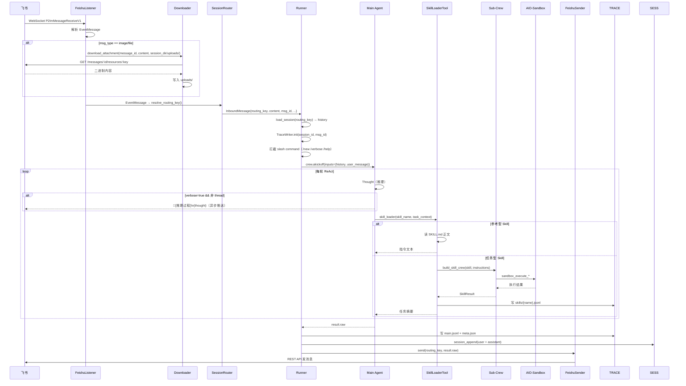
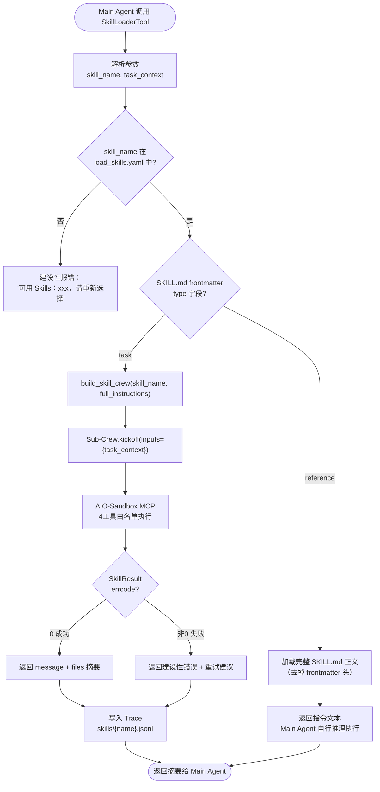
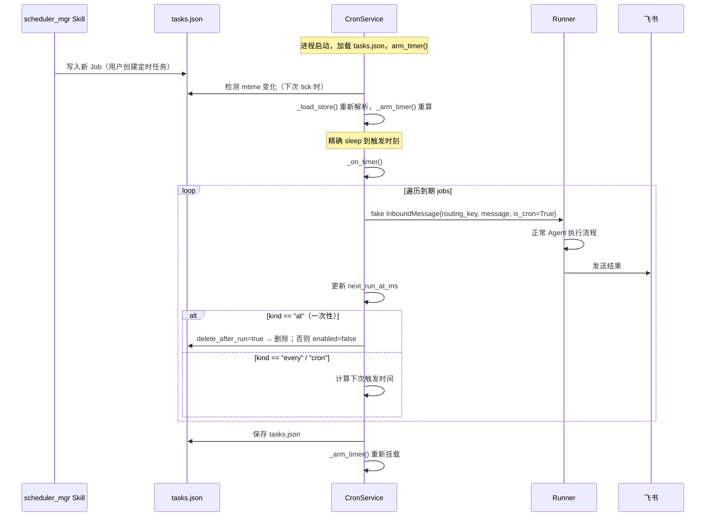
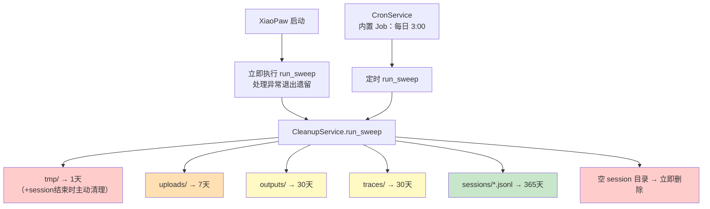

# XiaoPaw 详细设计文档

> **项目**：XiaoPaw（小爪子）——飞书本地工作助手
> **课程**：第17课 项目实战2（工具篇完结）
> **版本**：v0.1 草稿
> **最后更新**：2026-03-04

---

## 目录

1. [项目概述](#1-项目概述)
2. [系统架构](#2-系统架构)
3. [目录结构](#3-目录结构)
4. [模块设计](#4-模块设计)
   - 4.1 FeishuListener（飞书接入）
   - 4.2 SessionRouter（会话路由）
   - 4.3 Runner（执行引擎）
   - 4.4 Main Agent + SkillLoaderTool
   - 4.5 Sub-Crew 工厂
   - 4.6 CronService（定时调度）
   - 4.7 FeishuSender（消息发送）
   - 4.8 CleanupService（存储清理）
5. [数据设计](#5-数据设计)
   - 5.1 飞书事件数据结构
   - 5.2 内部消息：InboundMessage
   - 5.3 Session 存储
   - 5.4 Trace 存储
   - 5.5 Session 工作空间（中间产物）
   - 5.6 CronJob 数据结构
   - 5.7 Skill 定义结构
   - 5.8 SkillLoaderTool I/O
6. [接口设计](#6-接口设计)
   - 6.1 飞书消息接收接口
   - 6.2 飞书消息发送接口
   - 6.3 飞书文件/图片下载接口
7. [MVP Skills 设计](#7-mvp-skills-设计)
8. [功能特性设计](#8-功能特性设计)
   - 8.1 详细模式（Verbose Mode）
   - 8.2 Slash Command 系统
9. [安全设计](#9-安全设计)
10. [配置设计](#10-配置设计)
11. [运维设计](#11-运维设计)
    - 11.1 部署架构
    - 11.2 存储清理策略
12. [待确认事项](#12-待确认事项)

---

## 1. 项目概述

### 1.1 定位

**XiaoPaw**（小爪子）是基于飞书的**本地工作助手**，通过 Skills 生态（第16课）让 Agent 接入大量工具能力，同时保证企业级安全隔离。

| 维度 | 设计决策 |
|------|---------|
| 接入方式 | 飞书 WebSocket 长连接，无需公网 IP，适合本地/内网部署 |
| 能力扩展 | Skills 驱动，所有能力通过 SKILL.md 动态加载 |
| 执行安全 | 所有执行类操作统一走 AIO-Sandbox（Docker 隔离），credentials 不进模型 |
| 隔离单元 | 每个飞书应用对应一个独立的 Workspace 进程，技能/记忆/配置互不干扰 |

### 1.2 课程分工

| 课程 | 内容 |
|------|------|
| **第17课**（本课） | 完整框架 + 飞书接入 + 全部 MVP Skills + 定时任务 |
| **第22课**（记忆篇） | 长记忆沉淀、上下文管理、Entity Memory |

### 1.3 MVP Skills

| Skill | 类型 | 核心能力 |
|-------|------|---------|
| `file_processor` | 任务型 | PDF/DOCX 解析与格式转换 |
| `feishu_ops` | 任务型 | 读云文档、向指定群/用户发消息 |
| `baidu_search` | 任务型 | 百度搜索并摘要 |
| `scheduler_mgr` | 任务型 | 创建/查看/删除定时任务 |

---

## 2. 系统架构

### 2.1 整体架构图

```mermaid
graph TB
    subgraph 飞书平台
        FS_WS[飞书 WebSocket 事件]
        FS_API[飞书 REST API]
    end

    subgraph XiaoPaw 主进程
        FL[FeishuListener\nlark-oapi ws.Client]
        DL[FeishuDownloader\n文件/图片预下载]
        SR[SessionRouter\n路由键解析]
        Runner[Runner\n执行引擎]
        CS[CronService\nasyncio 精确 timer]

        subgraph Agent层
            MA[Main Agent\nSkillLoaderTool 唯一工具]
            SLT[SkillLoaderTool\n渐进式披露]
            SC[Sub-Crew\nbuild_skill_crew 工厂]
        end

        FS[FeishuSender\nREST 直发，不走 Skill]
        CLS[CleanupService\n定期清理过期文件]
    end

    subgraph 存储层
        IDX[(sessions/index.json\n路由映射 + session 元数据)]
        SESS[(sessions/jsonl\n清洁对话历史)]
        TRACE[(traces/\n完整执行追踪)]
        TJ[(cron/tasks.json\n定时任务配置)]
        WS[(workspace/sessions/{sid}/\nuploads / outputs / tmp)]
    end

    subgraph AIO-Sandbox 容器
        SB[MCP Server\n4工具白名单]
        CFG[.config/feishu.json\ncredentials 预置]
    end

    FS_WS -->|WebSocket 推送| FL
    FL -->|附件消息| DL
    DL -->|写入| WS
    FL -->|InboundMessage| SR
    DL -->|InboundMessage + 文件路径| SR
    SR --> Runner
    Runner -->|读写| IDX
    Runner -->|读写| SESS
    Runner -->|写入| TRACE
    Runner --> MA
    MA --> SLT
    SLT -->|参考型| MA
    SLT -->|任务型| SC
    SC -->|MCP| SB
    SB -->|读取| CFG
    SB -->|读写| WS
    Runner --> FS
    FS -->|REST API| FS_API
    CS -->|mtime 热重载| TJ
    CS -->|fake InboundMessage| Runner
    CLS -->|按策略删除| WS
    CLS -->|按策略删除| TRACE
    CLS -->|按策略删除| SESS
```

### 2.2 消息主处理时序



---

## 3. 目录结构

```
xiaopaw/
├── main.py                      # 进程入口：启动 Listener + CronService + CleanupService
├── config.yaml                  # Workspace 配置（见第10节）
├── requirements.txt
│
├── feishu/
│   ├── listener.py              # WebSocket 事件监听，事件 → InboundMessage
│   ├── downloader.py            # 飞书文件/图片下载，保存至 session uploads/
│   ├── sender.py                # 消息发送（create / reply），含重试
│   └── session_key.py           # routing_key 解析（p2p / group / thread）
│
├── runner.py                    # 执行引擎：session加载 → slash拦截 → Agent → 存储 → 发送
│
├── agents/
│   ├── main_crew.py             # 主 Crew 构建（build_main_crew，注入 step_callback）
│   └── skill_crew.py            # Sub-Crew 工厂（build_skill_crew）
│
├── tools/
│   └── skill_loader.py          # SkillLoaderTool（渐进式披露 + Sub-Crew 触发）
│
├── session/
│   ├── manager.py               # SessionManager（index.json 读写，session JSONL 读写）
│   └── models.py                # Session / SessionEntry 数据类
│
├── cron/
│   ├── service.py               # CronService（asyncio timer + mtime 热重载）
│   └── models.py                # CronJob / CronSchedule / CronPayload 数据类
│
├── cleanup/
│   └── service.py               # CleanupService（按策略清理存储）
│
├── skills/                      # Workspace 私有 Skills（覆盖全局）
│   ├── file_processor/
│   │   ├── SKILL.md
│   │   └── scripts/
│   ├── feishu_ops/
│   │   ├── SKILL.md
│   │   └── scripts/
│   ├── baidu_search/
│   │   ├── SKILL.md
│   │   └── scripts/
│   └── scheduler_mgr/
│       ├── SKILL.md
│       └── scripts/
│
└── data/                        # 运行时持久化数据（.gitignore）
    ├── sessions/
    │   ├── index.json           # routing_key → session 映射
    │   └── {session_id}.jsonl   # 清洁对话记录
    ├── traces/
    │   └── {session_id}/
    │       └── {ts}_{msg_id}/
    │           ├── meta.json
    │           ├── main.jsonl
    │           └── skills/
    │               └── {skill_name}.jsonl
    ├── cron/
    │   └── tasks.json           # 定时任务配置（由 scheduler_mgr Skill 写入）
    └── workspace/
        ├── .config/
        │   └── feishu.json      # 启动时写入的 credentials（只读）
        └── sessions/
            └── {session_id}/    # 每个 session 的文件工作区（挂载进沙盒）
                ├── uploads/     # 用户发来的文件（自动下载）
                ├── outputs/     # Skill 产出的成果文件
                └── tmp/         # Sub-Crew 临时工作区
```

---

## 4. 模块设计

### 4.1 FeishuListener（飞书接入）

**职责**：维护 WebSocket 长连接，接收飞书事件，解析后交给下游。

**接入方案**：WebSocket 长连接（lark-oapi `ws.Client`），无需公网 IP，适合本地/内网部署。

**消息类型处理**：

| msg_type | 处理逻辑 |
|----------|---------|
| `text` | 直接提取 `content.text`，构造 InboundMessage |
| `image` | 触发 Downloader 下载到 `uploads/`，content 改写为本地路径提示 |
| `file` | 触发 Downloader 下载到 `uploads/`，content 改写为本地路径提示 |
| `post` | 提取富文本纯文本部分，构造 InboundMessage |
| `audio` | 回复"暂不支持语音消息"，不进入 Agent |
| `sticker` | 忽略，不回复 |
| `merge_forward` | 回复"暂不支持转发合集"，不进入 Agent |

**伪代码**：

```python
class FeishuListener:
    def __init__(self, config, on_message: Callable[[InboundMessage], Awaitable]):
        self.on_message = on_message

    async def start(self):
        cli = lark.ws.Client(config.feishu.app_id, config.feishu.app_secret)
        cli.register(lark.ws.EventType.IM_MESSAGE_RECEIVE_V1, self._handle_event)
        await cli.start()

    async def _handle_event(self, event: P2ImMessageReceiveV1):
        msg = event.event.message
        sender = event.event.sender

        if msg.message_type in ("audio", "sticker"):
            return   # 静默忽略

        routing_key = resolve_routing_key(event)

        # 附件消息：先下载到 session uploads/
        content = await self._preprocess_content(msg, routing_key)

        await self.on_message(InboundMessage(
            routing_key=routing_key,
            content=content,
            msg_id=msg.message_id,
            root_id=msg.root_id or msg.message_id,
            sender_id=sender.id,
            ts=int(msg.create_time),
        ))
```

---

### 4.2 SessionRouter（会话路由）

**职责**：将飞书事件的三种会话类型统一映射为 `routing_key`，作为 Session 的唯一标识。

**路由规则**：

| 聊天类型 | 判断条件 | routing_key |
|---------|---------|-------------|
| 单聊 | `chat_type == "p2p"` | `p2p:{open_id}` |
| 普通群聊 | `chat_type == "group"` AND `thread_id` 为空 | `group:{chat_id}` |
| 话题群（某话题）| `chat_type == "group"` AND `thread_id` 非空 | `thread:{thread_id}` |

```python
def resolve_routing_key(event: P2ImMessageReceiveV1) -> str:
    msg = event.event.message
    sender = event.event.sender
    if msg.chat_type == "p2p":
        return f"p2p:{sender.id}"         # sender.id = open_id
    if msg.thread_id:
        return f"thread:{msg.thread_id}"
    return f"group:{msg.chat_id}"
```

---

### 4.3 Runner（执行引擎）

**职责**：核心协调层，串联 Session 管理、Agent 执行、存储写入、消息回复。

**主流程**：

```python
class Runner:
    async def handle(self, inbound: InboundMessage):
        # 1. Slash Command 拦截（不进入 Agent）
        if reply := self._handle_slash(inbound):
            await self.sender.send(inbound.routing_key, reply, inbound.root_id)
            return

        # 2. 加载 / 创建 Session
        session = self.session_mgr.get_or_create(inbound.routing_key)

        # 3. 加载对话历史（最近 max_turns 条）
        history = self.session_mgr.load_history(session.session_id, max_turns=20)

        # 4. 构建 Crew（注入 verbose step_callback）
        step_cb = self._make_step_callback(session, inbound.routing_key)
        crew = build_main_crew(step_callback=step_cb)

        # 5. 构建 Trace Writer
        trace = TraceWriter(session.session_id, inbound.msg_id)

        # 6. 执行主 Agent
        result = await crew.akickoff(inputs={
            "history": format_history(history),
            "user_message": inbound.content,
            "session_dir": f"/workspace/sessions/{session.session_id}",
        })

        # 7. 写 Trace + Session
        trace.finalize(result, skills_called=[...])
        self.session_mgr.append(session.session_id,
            user=inbound.content, feishu_msg_id=inbound.msg_id,
            assistant=result.raw)

        # 8. 发送回复
        await self.sender.send(inbound.routing_key, result.raw, inbound.root_id)
```

**Slash Command 处理**（在进入 Agent 前拦截）：

| 命令 | 处理逻辑 |
|------|---------|
| `/new` | 创建新 Session，更新 index.json active_session_id |
| `/verbose on/off` | 更新 session.verbose，立即生效 |
| `/verbose` | 查询当前 verbose 状态 |
| `/help` | 返回命令列表 |
| `/status` | 返回当前 session 信息 + 运行中任务数 |

---

### 4.4 Main Agent + SkillLoaderTool

**Main Agent 设计原则**：极简，唯一工具是 SkillLoaderTool。避免直接绑定飞书 API 等工具，保持 Agent 的能力可扩展性。

```python
main_agent = Agent(
    role="XiaoPaw 工作助手",
    goal="理解用户意图，通过 Skills 高效完成工作任务",
    backstory=(
        "你是一个飞书工作助手，拥有通过 Skills 调用各类能力的能力。"
        "遇到任何工作任务，先判断使用哪个 Skill，再调用 SkillLoaderTool 执行。"
    ),
    tools=[SkillLoaderTool(...)],   # 唯一工具
    llm=LLM(model="qwen3-max"),
    max_iter=50,
)
```

**SkillLoaderTool 工作原理**（渐进式披露）：



---

### 4.5 Sub-Crew 工厂

**职责**：任务型 Skill 触发时，动态构建隔离的 Sub-Crew，接入 AIO-Sandbox。

```python
def build_skill_crew(
    skill_name: str,
    skill_instructions: str,   # 完整 SKILL.md 正文
    session_id: str,
    sandbox_url: str,
) -> Crew:
    agent = Agent(
        role=f"{skill_name} 执行专家",
        goal=skill_instructions,
        tools=[],                     # 工具全部由 MCP 提供
        mcps=[MCPServerHTTP(
            url=sandbox_url,
            tool_filter=create_static_tool_filter(allowed_tool_names=[
                "sandbox_execute_bash",
                "sandbox_execute_code",
                "sandbox_file_operations",
                "sandbox_str_replace_editor",
            ])
        )],
        llm=LLM(model="qwen3-max"),
        max_iter=20,
    )
    task = Task(
        description=(
            "{task_context}\n\n"
            f"当前 session 工作目录：/workspace/sessions/{session_id}/\n"
            "  uploads/  ← 用户上传文件\n"
            "  outputs/  ← 产出文件存放目录\n"
            "  tmp/      ← 临时工作区"
        ),
        expected_output="JSON 格式的 SkillResult",
        output_pydantic=SkillResult,
        agent=agent,
    )
    return Crew(agents=[agent], tasks=[task], verbose=False)
```

**设计要点**：
- 每次 Skill 调用都构建**新实例**，防止状态污染
- Sub-Crew 不注入 `step_callback`（verbose 只推主 Agent）
- session_id 通过 task.description 注入，Agent 知道自己的工作目录

---

### 4.6 CronService（定时调度）

**职责**：读取 `cron/tasks.json`，精确调度定时任务，触发时构造 fake InboundMessage 进入 Runner 管道。

**核心设计**：
- **asyncio timer**（非 APScheduler/轮询），精确睡眠到下一个 job 触发时刻
- **mtime 热重载**：scheduler_mgr Skill 写入 tasks.json 后，CronService 下次 tick 自动感知并重新解析
- **内置清理 Job**：每日 3:00 触发 CleanupService，内存注册不写入 tasks.json



**三种调度模式**：

| 用户说 | schedule.kind | 参数示例 | 到期后 |
|-------|--------------|---------|-------|
| 明天10点提醒开会 | `at` | `at_ms: 1738800000000` | `delete_after_run: true` 自动删除 |
| 每20分钟提醒站起来 | `every` | `every_ms: 1200000` | 循环执行 |
| 每周一早9点生成周报 | `cron` | `expr: "0 9 * * 1"`, `tz: "Asia/Shanghai"` | croniter 计算下次，循环执行 |

---

### 4.7 FeishuSender（消息发送）

**职责**：根据 routing_key 类型选择正确的飞书发送 API，含幂等控制和重试。

**API 选择逻辑**：

```mermaid
flowchart TD
    SEND([FeishuSender.send]) --> RK{routing_key 类型}

    RK -->|p2p:{open_id}| P2P["POST /im/v1/messages\nreceive_id_type=open_id"]
    RK -->|group:{chat_id}| GRP["POST /im/v1/messages\nreceive_id_type=chat_id"]
    RK -->|thread:{thread_id}| THR["POST /im/v1/messages/:root_id/reply\nreply_in_thread=true"]

    P2P & GRP & THR --> BODY["RequestBody\nmsg_type='text'\ncontent='{\"text\":\"...\"}'\nuuid={msg_id}  ← 幂等去重"]
    BODY --> RESP{API 响应}
    RESP -->|成功| DONE([完成])
    RESP -->|失败| RETRY["最多重试 3 次\n指数退避 1s/2s/4s"]
```

**关键点**：
- 话题群（thread）回复：使用 `ReplyMessage` API，`message_id=root_id`，`reply_in_thread=True`
- `uuid` 字段传入 `feishu_msg_id`，防止网络重试重复发送（飞书幂等去重）
- Bot 自身回复**不走 Skill**，直接在 Runner 层调用 FeishuSender

---

### 4.8 CleanupService（存储清理）

**职责**：按策略清理过期文件，防止磁盘无限增长。双触发：启动时 Sweep + 每日 3:00 定时任务。

```python
CLEANUP_POLICIES = [
    CleanupPolicy("data/workspace/sessions/*/tmp/**",     max_age_days=1),
    CleanupPolicy("data/workspace/sessions/*/uploads/**", max_age_days=7),
    CleanupPolicy("data/workspace/sessions/*/outputs/**", max_age_days=30),
    CleanupPolicy("data/traces/**",                       max_age_days=30),
    CleanupPolicy("data/sessions/*.jsonl",                max_age_days=365),
]
```

详见 [11.2 存储清理策略](#112-存储清理策略)。

---

## 5. 数据设计

### 5.1 飞书事件数据结构

> 来源：SDK `lark_oapi/api/im/v1/model/event_message.py` + `sender.py`（已验证）

```python
class EventMessage:
    message_id:   str   # 消息唯一 ID，如 "om_xxxxx"
    root_id:      str   # 话题根消息 ID（话题群中有值，用于 reply_in_thread）
    parent_id:    str   # 父消息 ID（回复链）
    create_time:  int   # 消息创建时间（毫秒时间戳）
    chat_id:      str   # 会话 ID（群聊时有值）
    thread_id:    str   # 话题 ID（话题群的某话题内有值，否则为空）
    chat_type:    str   # "p2p" | "group"
    message_type: str   # "text" | "image" | "file" | "audio" | ...
    content:      str   # JSON 字符串
    mentions:     list  # @提及列表

class Sender:
    id:           str   # open_id，如 "ou_xxxxxxx"
    id_type:      str   # "open_id"
    sender_type:  str   # "user"
    tenant_key:   str   # 企业 key
```

**content 字段结构（按 msg_type）**：

| msg_type | content JSON |
|----------|-------------|
| `text` | `{"text": "用户消息内容"}` |
| `image` | `{"image_key": "img_xxxxx"}` |
| `file` | `{"file_key": "file_xxxxx", "file_name": "report.pdf"}` |
| `audio` | `{"file_key": "..."}` |

---

### 5.2 内部消息：InboundMessage

框架内流转的标准化消息对象：

```python
@dataclass
class InboundMessage:
    routing_key: str          # "p2p:ou_xxx" | "group:xxx" | "thread:xxx"
    content:     str          # 纯文本内容（已预处理：附件消息转为路径提示）
    msg_id:      str          # 飞书 message_id（用于幂等、Trace）
    root_id:     str          # 话题根消息 ID（thread 回复时用，非 thread 时 = msg_id）
    sender_id:   str          # open_id（发送者）
    ts:          int          # 创建时间（毫秒时间戳）
    is_cron:     bool = False  # True = CronService 注入的 fake 消息
```

---

### 5.3 Session 存储

#### index.json（路由映射 + session 元数据）

```json
{
  "p2p:ou_abc123": {
    "active_session_id": "s-uuid-002",
    "sessions": [
      {
        "id": "s-uuid-001",
        "created_at": "2026-01-15T09:00:00Z",
        "verbose": false,
        "message_count": 12
      },
      {
        "id": "s-uuid-002",
        "created_at": "2026-01-20T14:00:00Z",
        "verbose": true,
        "message_count": 8
      }
    ]
  },
  "group:oc_chat456": {
    "active_session_id": "s-uuid-003",
    "sessions": [
      {
        "id": "s-uuid-003",
        "created_at": "2026-01-18T10:00:00Z",
        "verbose": false,
        "message_count": 5
      }
    ]
  }
}
```

**字段说明**：

| 字段 | 说明 |
|------|------|
| `active_session_id` | 当前活跃的 session（`/new` 命令会更新此字段） |
| `verbose` | 详细模式开关，session 级别，默认 `false` |
| `message_count` | 用于快速判断 session 大小，不需读全部 JSONL |

#### {session_id}.jsonl（清洁对话记录）

```jsonl
{"type":"meta","session_id":"s-uuid-002","routing_key":"p2p:ou_abc123","workspace_id":"xiaopaw-hr","created_at":"2026-01-20T14:00:00Z"}
{"type":"message","role":"user","content":"帮我把这个 PDF 转成 Word","ts":1737000000,"feishu_msg_id":"om_xxx"}
{"type":"message","role":"assistant","content":"转换完成，文件已保存到 outputs/result.docx","ts":1737000025}
{"type":"message","role":"user","content":"每周一9点给我发周报提醒","ts":1737001000,"feishu_msg_id":"om_yyy"}
{"type":"message","role":"assistant","content":"已创建定时任务：每周一 09:00 生成并发送周报摘要。","ts":1737001010}
```

---

### 5.4 Trace 存储

每次消息处理对应一个 Trace 目录，记录完整的 LLM 上下文：

```
data/traces/{session_id}/{ts}_{msg_id}/
├── meta.json          # 执行摘要
├── main.jsonl         # 主 Agent 完整 context_messages
└── skills/
    ├── file_processor.jsonl   # file_processor Sub-Crew context
    └── feishu_ops.jsonl
```

**meta.json**：

```json
{
  "session_id":    "s-uuid-002",
  "feishu_msg_id": "om_xxx",
  "root_id":       "om_root_xxx",
  "routing_key":   "p2p:ou_abc123",
  "user_message":  "帮我把这个 PDF 转成 Word",
  "skills_called": ["file_processor"],
  "duration_ms":   25340,
  "ts_start":      1737000000000,
  "ts_end":        1737000025340,
  "is_cron":       false
}
```

**main.jsonl**（主 Agent LLM context）：

```jsonl
{"role":"user","content":"【历史】...\n【session目录】/workspace/sessions/s-uuid-002\n【当前】帮我把这个 PDF 转成 Word"}
{"role":"assistant","tool_calls":[{"name":"skill_loader","args":{"skill_name":"file_processor","task_context":"输入:/workspace/sessions/s-uuid-002/uploads/report.pdf，输出:docx，存至outputs/"},"call_id":"c001"}]}
{"role":"tool","name":"skill_loader","call_id":"c001","content":"{\"errcode\":0,\"message\":\"转换成功\",\"files\":[\"/workspace/sessions/s-uuid-002/outputs/result.docx\"]}"}
{"role":"assistant","content":"转换完成，文件已保存到 outputs/result.docx。"}
```

---

### 5.5 Session 工作空间（中间产物）

每个 session 在主机上拥有独立的文件工作区，整体挂载进 AIO-Sandbox 容器：

```
data/workspace/
├── .config/
│   └── feishu.json              # 启动时写入，Sub-Crew 从此读取 credentials
└── sessions/
    └── {session_id}/
        ├── uploads/             # 用户通过飞书发来的文件（自动下载）
        ├── outputs/             # Skill 产出的成果文件
        └── tmp/                 # Sub-Crew 临时工作区（session 结束后主动清理）
```

**沙盒内可见路径**（docker-compose 挂载整个 workspace/）：

```
/workspace/.config/feishu.json
/workspace/sessions/{session_id}/uploads/
/workspace/sessions/{session_id}/outputs/
/workspace/sessions/{session_id}/tmp/
```

**设计原则**：
- 不同 session 目录完全隔离，Sub-Crew 只能访问自己 session 的目录
- SkillLoaderTool 在 task.description 中注入 session 目录路径，Agent 无需记忆路径规则

---

### 5.6 CronJob 数据结构

```json
{
  "version": 1,
  "jobs": [
    {
      "id": "job-abc123",
      "name": "每周工作摘要",
      "enabled": true,
      "schedule": {
        "kind": "cron",
        "expr": "0 9 * * 1",
        "tz": "Asia/Shanghai",
        "at_ms": null,
        "every_ms": null
      },
      "payload": {
        "routing_key": "p2p:ou_abc123",
        "message": "请生成本周工作摘要并发给我"
      },
      "state": {
        "next_run_at_ms": 1738800000000,
        "last_run_at_ms": null,
        "last_status": null,
        "last_error": null
      },
      "created_at_ms": 1736900000000,
      "updated_at_ms": 1736900000000,
      "delete_after_run": false
    },
    {
      "id": "job-def456",
      "name": "明天开会提醒",
      "enabled": true,
      "schedule": {
        "kind": "at",
        "at_ms": 1738800000000,
        "expr": null,
        "tz": null,
        "every_ms": null
      },
      "payload": {
        "routing_key": "p2p:ou_abc123",
        "message": "提醒：30分钟后有产品评审会议"
      },
      "state": {
        "next_run_at_ms": 1738800000000,
        "last_run_at_ms": null,
        "last_status": null,
        "last_error": null
      },
      "created_at_ms": 1736900000000,
      "updated_at_ms": 1736900000000,
      "delete_after_run": true
    }
  ]
}
```

---

### 5.7 Skill 定义结构

#### SKILL.md frontmatter

```yaml
---
name: file_processor           # Skill 唯一标识（与目录名一致）
description: "PDF/DOCX 解析与格式转换"  # XML 摘要中展示，帮助主 Agent 选择
type: task                     # reference（参考型）| task（任务型）
version: "1.0"
---

# file_processor Skill

## 功能说明
...（完整执行指令，由 Sub-Crew 读取）
```

#### load_skills.yaml

```yaml
skills:
  - name: file_processor
    path: ./skills/file_processor
    enabled: true
  - name: feishu_ops
    path: ./skills/feishu_ops
    enabled: true
  - name: baidu_search
    path: ./skills/baidu_search
    enabled: true
  - name: scheduler_mgr
    path: ./skills/scheduler_mgr
    enabled: true
```

#### 主 Agent 注入的 XML 摘要（SkillLoaderTool description 中携带）

```xml
<skills>
  <skill type="task">
    <name>file_processor</name>
    <description>PDF/DOCX 解析与格式转换，支持 PDF→DOCX、PDF→Markdown</description>
  </skill>
  <skill type="task">
    <name>feishu_ops</name>
    <description>飞书操作：读取云文档内容、向指定群/用户发消息</description>
  </skill>
  <skill type="task">
    <name>baidu_search</name>
    <description>百度搜索并摘要返回结果，适合信息检索类任务</description>
  </skill>
  <skill type="task">
    <name>scheduler_mgr</name>
    <description>创建/查看/删除定时任务，支持一次性/周期/cron 三种触发模式</description>
  </skill>
</skills>
```

---

### 5.8 SkillLoaderTool I/O（Pydantic）

```python
class SkillLoaderInput(BaseModel):
    skill_name: str = Field(
        description="要调用的 Skill 名称，必须是 XML 摘要中 <name> 标签的值之一"
    )
    task_context: str = Field(
        description=(
            "【任务型 Skill 必须包含以下四项，缺一不可】\n"
            "1. 输入文件/数据的沙盒绝对路径（如 /workspace/sessions/{sid}/uploads/report.pdf）\n"
            "2. 期望输出内容和格式（如：转为 docx，保留原始排版）\n"
            "3. 输出文件沙盒绝对路径（如 /workspace/sessions/{sid}/outputs/result.docx）\n"
            "4. 特殊要求（无则填'无'）\n"
            "【参考型 Skill 填写用户的原始问题即可】"
        )
    )

class SkillResult(BaseModel):
    errcode: int        # 0=成功，非0=失败
    message: str        # 人类可读的结果摘要（主 Agent 直接用于回复用户）
    data:    dict       # 结构化结果数据（可选，默认 {}）
    files:   list[str]  # 产出文件在沙盒中的绝对路径列表（可选，默认 []）
```

---

## 6. 接口设计

### 6.1 飞书消息接收接口

**协议**：飞书 WebSocket 长连接（lark-oapi `ws.Client`）

**事件类型**：`P2ImMessageReceiveV1`（接收到消息）

**触发条件**：
- 单聊：任意消息
- 群聊：@Bot 消息 或 Bot 是群主
- 话题群：话题内的消息

---

### 6.2 飞书消息发送接口

> 来源：SDK `create_message_request_body.py` + `reply_message_request_body.py`（已验证）

```python
# 单聊 / 群聊：新建消息
# POST /open-apis/im/v1/messages?receive_id_type={open_id|chat_id}
class CreateMessageRequestBody:
    receive_id: str   # open_id（单聊）或 chat_id（群聊）
    msg_type:   str   # "text"
    content:    str   # JSON 字符串：'{"text":"回复内容"}'
    uuid:       str   # 幂等 key，防重发

# 话题群：在话题内回复
# POST /open-apis/im/v1/messages/:root_id/reply
class ReplyMessageRequestBody:
    content:         str   # 同上
    msg_type:        str
    reply_in_thread: bool  # True = 在话题内回复
    uuid:            str   # 幂等 key
```

---

### 6.3 飞书文件/图片下载接口

> 来源：SDK `get_message_resource_request.py` + `get_message_resource_response.py`（已验证）

**API**：`GET /open-apis/im/v1/messages/:message_id/resources/:file_key?type=image|file`

```python
async def download_attachment(
    client: lark.Client,
    message_id: str,
    content_json: str,     # EventMessage.content（JSON 字符串）
    msg_type: str,         # "image" | "file"
    dest_dir: Path,        # session 的 uploads/ 目录
) -> Path | None:

    content = json.loads(content_json)
    if msg_type == "image":
        file_key = content["image_key"]
        resource_type = "image"
        file_name = f"{file_key}.jpg"     # 飞书图片无文件名，用 key 命名
    elif msg_type == "file":
        file_key = content["file_key"]
        resource_type = "file"
        file_name = content.get("file_name", file_key)

    request = (
        GetMessageResourceRequest.builder()
        .message_id(message_id)
        .file_key(file_key)
        .type(resource_type)
        .build()
    )
    response = await client.im.v1.message_resource.aget(request)

    if not response.success():
        return None

    # response.file = BytesIO，response.file_name = 从响应头提取的文件名
    actual_name = response.file_name or file_name
    dest_path = dest_dir / actual_name
    dest_path.write_bytes(response.file.read())
    return dest_path
```

**下载后的 user_message 模板**：

```python
def build_file_message(file_path: str, original_text: str = "") -> str:
    extra = f"\n用户备注：{original_text}" if original_text else ""
    return (
        f"用户发来了文件，已自动保存至沙盒路径：\n"
        f"`{file_path}`\n"
        f"请根据文件内容和用户意图完成相应处理。{extra}"
    )
```

---

## 7. MVP Skills 设计

### file_processor

| 项目 | 内容 |
|------|------|
| 类型 | 任务型（task） |
| 核心能力 | PDF 解析、PDF→DOCX/Markdown、DOCX 读取 |
| 沙盒依赖 | `pypdf`, `python-docx`, `markitdown` |
| 典型调用 | "帮我把这个 PDF 转成 Word" |

### feishu_ops

| 项目 | 内容 |
|------|------|
| 类型 | 任务型（task） |
| 核心能力 | 读取飞书云文档、向指定群/用户发消息、查询消息历史 |
| 沙盒依赖 | `lark-oapi`，credentials 从 `/workspace/.config/feishu.json` 读取 |
| 典型调用 | "把这份文档的内容总结发到 HR 群" |

### baidu_search

| 项目 | 内容 |
|------|------|
| 类型 | 任务型（task） |
| 核心能力 | 百度搜索、解析结果、摘要返回 |
| 沙盒依赖 | `requests`, `beautifulsoup4` |
| 典型调用 | "搜索一下最新的 Python 3.13 发布说明" |

### scheduler_mgr

| 项目 | 内容 |
|------|------|
| 类型 | 任务型（task） |
| 核心能力 | 解析自然语言意图 → 生成结构化 Job → 写入 `cron/tasks.json` |
| 沙盒依赖 | 仅文件读写（`sandbox_file_operations`） |
| 典型调用 | "每周一早上9点提醒我写周报" |
| 特殊说明 | **只管配置，不管执行**；执行由框架层 CronService 负责 |

---

## 8. 功能特性设计

### 8.1 详细模式（Verbose Mode）

**功能**：启用后，主 Agent 每轮 ReAct 的 Thought 推理过程实时推送给用户。

**适用范围**：单聊（p2p）✅ 群聊（group）✅ 话题群（thread）❌ Sub-Crew ❌

**实现**：通过 CrewAI `step_callback` 拦截 `AgentAction.log`，提取 Thought 内容异步推送飞书。

```python
def _make_step_callback(self, session: SessionEntry, routing_key: str):
    def step_callback(step_output):
        if not session.verbose:
            return
        if routing_key.startswith("thread:"):
            return
        # 提取 Thought（AgentAction.log 格式："Thought: ...\nAction: ..."）
        if not hasattr(step_output, "log"):
            return
        log = step_output.log or ""
        if "Thought:" not in log:
            return
        thought = log.split("Action:")[0].replace("Thought:", "").strip()
        if thought:
            asyncio.create_task(
                self.sender.send(routing_key, f"💭 [推理过程]\n{thought}")
            )
    return step_callback
```

**消息格式**：
```
💭 [推理过程]
用户发来了 PDF 文件，我需要调用 file_processor Skill 进行转换操作。
输入路径：/workspace/sessions/s-xxx/uploads/report.pdf
```

**控制命令**：`/verbose on` | `/verbose off` | `/verbose`（查询状态）

---

### 8.2 Slash Command 系统

所有 Slash Command 在 Runner 层**进入 Agent 之前**拦截处理：

| 命令 | 处理逻辑 | 回复示例 |
|------|---------|---------|
| `/new` | 创建新 Session，更新 active_session_id | "已创建新对话，之前的历史不会带入。" |
| `/verbose on` | session.verbose = True | "✅ 详细模式已开启，我会把推理过程发给你。" |
| `/verbose off` | session.verbose = False | "✅ 详细模式已关闭。" |
| `/verbose` | 查询当前状态 | "当前详细模式：开启/关闭" |
| `/status` | 返回 session 信息 | "当前对话：s-xxx，已有 8 条消息，详细模式：关闭" |
| `/help` | 返回命令列表 | 所有命令说明 |

---

## 9. 安全设计

| 原则 | 实现方式 |
|------|---------|
| **Credentials 不进模型** | 启动时从 config.yaml 读取凭证，写入沙盒 `.config/feishu.json`；Skill 脚本直接读文件，全程不经过 LLM |
| **沙盒工具白名单** | `create_static_tool_filter` 限定 4 个工具（bash/code/file_ops/editor），防止 MCP 工具越权 |
| **Session 隔离** | routing_key 精确到 open_id/chat_id/thread_id，不同用户/群聊完全隔离 |
| **文件目录隔离** | 每个 session 独立工作目录，Sub-Crew 只注入自身 session 路径 |
| **Bot 回复不走 Skill** | FeishuSender 在 Runner 层直接调用，不经过 Agent/Skill |
| **幂等发送** | CreateMessage/Reply 均传入 uuid（飞书 message_id），防止网络重试重复发送 |

---

## 10. 配置设计

```yaml
# config.yaml
workspace:
  id: "xiaopaw-default"           # Workspace 唯一标识（多实例时区分）
  name: "XiaoPaw 工作助手"

feishu:
  app_id: "${FEISHU_APP_ID}"      # 推荐用环境变量，不硬编码
  app_secret: "${FEISHU_APP_SECRET}"
  encrypt_key: ""                 # 可选：事件加密
  verification_token: ""          # 可选：事件验证

bot:
  loading_message: "思考中..."    # 处理中提示（可选，未启用则无提示）
  prefix: ""                      # 消息前缀（如 "[小爪] "，可选）

agent:
  model: "qwen3-max"
  max_iter: 50
  max_input_tokens: 30000

skills:
  global_dir: "../skills"         # 全局 Skills 目录（跨 Workspace 共享）
  local_dir: "./skills"           # 本 Workspace 私有 Skills（可覆盖全局）

sandbox:
  url: "http://localhost:8080/mcp"
  workspace_dir: "/workspace"     # 沙盒内挂载路径

session:
  max_history_turns: 20           # 注入对话历史的最大轮数（MVP 简单截断）

data_dir: "./data"                # 运行时数据根目录
```

---

## 11. 运维设计

### 11.1 部署架构

```
主机
├── xiaopaw/          ← XiaoPaw 主进程（Python）
│   └── data/         ← 持久化数据（挂载给 Docker）
└── docker-compose.yml

Docker 容器
└── aio-sandbox       ← AIO-Sandbox MCP Server
    └── /workspace    ← 挂载自主机 xiaopaw/data/workspace/
```

**docker-compose.yml 挂载配置**：

```yaml
services:
  aio-sandbox:
    image: aio-sandbox:latest
    ports:
      - "8080:8080"
    volumes:
      - ./data/workspace:/workspace   # 整个 workspace 挂载进容器
    restart: unless-stopped
```

---

### 11.2 存储清理策略

**全量存储一览**：

| 存储位置 | 内容 | 大小特征 | 清理策略 |
|---------|------|---------|---------|
| `data/sessions/index.json` | session 路由映射 | 极小（KB） | 永久保留 |
| `data/sessions/{sid}.jsonl` | 清洁对话历史 | 中（每条约 1KB） | 365 天后删除 |
| `data/traces/` | 完整执行追踪 | 大（每次 MB 级） | 30 天后删除 |
| `data/workspace/sessions/*/uploads/` | 用户上传文件 | 大（原始文件大小） | 7 天后删除 |
| `data/workspace/sessions/*/outputs/` | Skill 产出文件 | 大（产物文件） | 30 天后删除 |
| `data/workspace/sessions/*/tmp/` | Sub-Crew 临时文件 | 中 | Session 结束立即清理；兜底 1 天 |
| `data/cron/tasks.json` | 定时任务配置 | 极小 | 永久保留（任务自身 delete_after_run） |
| `data/workspace/.config/feishu.json` | Credentials | 极小 | 永久保留（随配置更新） |

**双触发清理**：



**session.jsonl 归档 TODO**（MVP 直接删除，第22课记忆篇补充）：
- 进阶：移至 `data/sessions/archive/`，压缩为 `.jsonl.gz`
- 长远：对话历史 embedding 进向量库后，JSONL 原文件重要性降低，清理策略可更激进

---

## 12. 待确认事项

| 编号 | 问题 | 状态 |
|------|------|------|
| T-01 | 话题群回复 API | ✅ 已确认：`ReplyMessage` API，`POST /messages/:root_id/reply`，`reply_in_thread=True` |
| T-02 | AIO-Sandbox workspace 挂载方式 | ✅ 已确认：docker-compose 统一挂载 `./data/workspace:/workspace`，`.config/feishu.json` 直接可读 |
| T-03 | Sub-Crew Trace 写入时机 | ✅ 已确认：Sub-Crew 任务结束后，在 `SkillLoaderTool._run()` return 前手动写入 `skills/{name}.jsonl` |
| T-04 | CronService 依赖 | ✅ 已确认：`croniter` 加入 `requirements.txt` |
| T-05 | 飞书 Bot 接收消息条件 | ✅ 已配置：飞书开放平台权限已申请，待上线后测试验证 |
| T-06 | 文件下载权限 | ✅ 已配置：飞书开放平台权限已申请，待上线后测试验证 |
