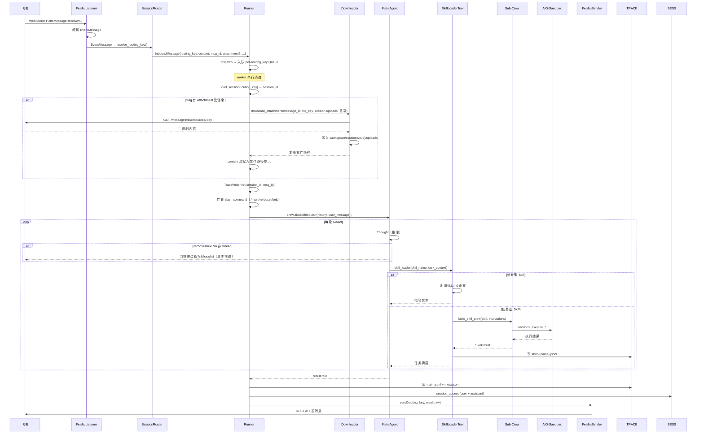
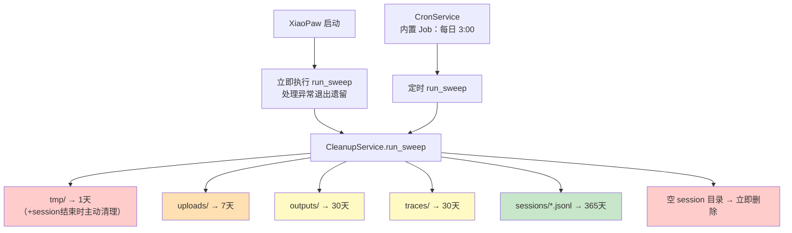

# XiaoPaw 详细设计文档

> **项目**：XiaoPaw（小爪子）——飞书本地工作助手
> **课程**：第17课 项目实战2（工具篇）
> **版本**：v0.1 草稿
> **最后更新**：2026-03-05

---

## 目录

1. [项目概述](#1-项目概述)
2. [系统架构](#2-系统架构)
3. [目录结构](#3-目录结构)
4. [模块设计](#4-模块设计) → [详细文档](docs/design-modules.md)
5. [数据设计](#5-数据设计) → [详细文档](docs/design-data.md)
6. [接口设计](#6-接口设计) → [详细文档](docs/design-api.md)
7. [MVP Skills 设计](#7-mvp-skills-设计)
8. [功能特性设计](#8-功能特性设计)
9. [安全设计](#9-安全设计)
10. [配置设计](#10-配置设计)
11. [运维设计](#11-运维设计)
12. [待确认事项](#12-待确认事项)
13. [可观测性设计](#13-可观测性设计) → [详细文档](docs/design-observability.md)

---

## 1. 项目概述

### 1.1 定位

**XiaoPaw**（小爪子）是基于飞书的**本地工作助手**，通过 Skills 生态（第16课）让 Agent 接入大量工具能力，同时保证企业级安全隔离。

| 维度 | 设计决策 |
|------|---------|
| 接入方式 | 飞书 WebSocket 长连接，无需公网 IP，适合本地/内网部署 |
| 能力扩展 | Skills 驱动，所有能力通过 SKILL.md 动态加载 |
| 执行安全 | 所有执行类操作统一走 AIO-Sandbox（Docker 隔离），credentials 不进模型 |
| 隔离单元 | 每个飞书应用对应一个独立的 Workspace 进程，技能/记忆/配置互不干扰 |

### 1.2 课程分工

| 课程 | 内容 |
|------|------|
| **第17课**（本课） | 完整框架 + 飞书接入 + 全部 MVP Skills + 定时任务 |
| **第22课**（记忆篇） | 长记忆沉淀、上下文管理、Entity Memory |

### 1.3 MVP Skills

| Skill | 类型 | 核心能力 |
|-------|------|---------|
| `file_processor` | 任务型 | PDF/DOCX 解析与格式转换 |
| `feishu_ops` | 任务型 | 读云文档、向指定群/用户发消息 |
| `baidu_search` | 任务型 | 百度搜索并摘要 |
| `scheduler_mgr` | 任务型 | 创建/查看/删除定时任务 |

### 1.4 当前实现进度（2026-03-05）

- **已在主链路跑通**：飞书 WebSocket → FeishuListener → Runner（含 per-routing_key 队列与 Slash 命令占位）→ FeishuSender，默认固定回复“收到，session={id}”。
- **基础设施已完成并有测试**：Session 模型与 SessionManager、Cron 数据模型与 CronService、本地测试用 TestAPI、AliyunLLM 适配层、Metrics 与 /metrics 服务器、Feishu 附件下载器等（详见 `CLAUDE.md` 的 Development Progress）。
- **已实现但尚未接入主链路**：CrewAI 主 Agent `MainCrew` 及其 YAML 配置、`history_reader` Skill 等，目前只在测试与设计层面使用。
- **尚未实现**：`agents/skill_crew.py`、`tools/skill_loader.py`、`cleanup/service.py` 等仍处于设计阶段，本设计文档按目标架构描述这些模块的预期行为。

---

## 2. 系统架构

### 2.1 整体架构图

```mermaid
graph TB
    subgraph 飞书平台
        FS_WS[飞书 WebSocket 事件]
        FS_API[飞书 REST API]
    end

    subgraph XiaoPaw 主进程
        FL[FeishuListener\nlark-oapi ws.Client]
        SR[SessionRouter\n路由键解析]
        Runner[Runner\n执行引擎]
        DL[FeishuDownloader\n文件/图片下载]
        CS[CronService\nasyncio 精确 timer]

        subgraph Agent层
            MA[Main Agent\nSkillLoaderTool 唯一工具]
            SLT[SkillLoaderTool\n渐进式披露]
            SC[Sub-Crew\nbuild_skill_crew 工厂]
        end

        FS[FeishuSender\nREST 直发，不走 Skill]
        CLS[CleanupService\n定期清理过期文件]
    end

    subgraph 存储层
        IDX[(sessions/index.json\n路由映射 + session 元数据)]
        SESS[(sessions/jsonl\n清洁对话历史)]
        TRACE[(traces/\n完整执行追踪)]
        TJ[(cron/tasks.json\n定时任务配置)]
        WS[(workspace/sessions/{sid}/\nuploads / outputs / tmp)]
    end

    subgraph AIO-Sandbox 容器
        SB[MCP Server\n4工具白名单]
        CFG[.config/feishu.json\ncredentials 预置]
    end

    FS_WS -->|WebSocket 推送| FL
    FL -->|InboundMessage\n含附件元信息| SR
    SR --> Runner
    Runner -->|读写| IDX
    Runner -->|session 确定后| DL
    DL -->|GET /messages/:id/resources/:key| FS_API
    DL -->|写入 session uploads/| WS
    Runner -->|读写| SESS
    Runner -->|写入| TRACE
    Runner --> MA
    MA --> SLT
    SLT -->|参考型| MA
    SLT -->|任务型| SC
    SC -->|MCP| SB
    SB -->|读取| CFG
    SB -->|读写| WS
    Runner --> FS
    FS -->|REST API| FS_API
    CS -->|mtime 热重载| TJ
    CS -->|fake InboundMessage| Runner
    CLS -->|按策略删除| WS
    CLS -->|按策略删除| TRACE
    CLS -->|按策略删除| SESS
```

### 2.2 消息主处理时序



---

## 3. 目录结构

```
xiaopaw/
├── main.py / config.yaml / requirements.txt
├── llm/aliyun_llm.py            # CrewAI BaseLLM 适配器（通义千问）
├── feishu/
│   ├── listener.py              # WebSocket 事件 → InboundMessage
│   ├── downloader.py            # 文件/图片下载（session 确定后调用）
│   ├── sender.py                # 消息发送（create/reply），含重试
│   └── session_key.py           # routing_key 解析
├── api/test_server.py           # 测试 API（仅 debug 模式）
├── runner.py                    # 执行引擎（session/slash/Agent/存储/发送）
├── agents/
│   ├── main_crew.py             # 主 Crew（build_main_crew，已实现，待接入主链路）
│   └── skill_crew.py            # Sub-Crew 工厂（build_skill_crew，TODO）
├── tools/
│   ├── skill_loader.py          # SkillLoaderTool（渐进式披露，TODO）
│   ├── add_image_tool_local.py  # 本地图片 → Base64 Data URL
│   ├── baidu_search_tool.py     # 百度千帆 web_search 封装
│   └── intermediate_tool.py     # 中间产物保存
├── observability/
│   ├── logging_config.py        # 日志（控制台 + JSON 行文件）
│   ├── metrics.py               # Prometheus 指标定义
│   └── metrics_server.py        # /metrics HTTP 服务
├── session/manager.py + models.py
├── cron/service.py + models.py
├── cleanup/service.py           # CleanupService 实现（TODO）
├── skills/                      # file_processor/ feishu_ops/ baidu_search/ scheduler_mgr/ history_reader/
└── data/                        # 运行时数据（.gitignore）
    ├── sessions/index.json + {sid}.jsonl
    ├── traces/{sid}/{ts}_{msg_id}/  # meta.json + main.jsonl + skills/
    ├── cron/tasks.json
    └── workspace/.config/feishu.json + sessions/{sid}/uploads|outputs|tmp
```

---

## 4. 模块设计

各模块设计详见 [docs/design-modules.md](docs/design-modules.md)。

**模块概览**：

| 模块 | 说明 |
|------|------|
| FeishuListener | 维护 WebSocket 长连接，解析飞书事件为 InboundMessage，不负责文件下载 |
| SessionRouter | 将三种飞书会话类型（p2p/group/thread）映射为统一的 routing_key |
| Runner | 核心协调层，per-routing_key 串行队列，串联 Session/Agent/存储/发送 |
| Main Agent + SkillLoaderTool | 极简主 Agent，唯一工具 SkillLoaderTool，渐进式披露 Skills 能力 |
| Sub-Crew 工厂 | 任务型 Skill 触发时动态构建隔离 Sub-Crew，接入 AIO-Sandbox MCP |
| CronService | asyncio 精确 timer 调度，mtime 热重载 tasks.json，fake 消息进 Runner |
| FeishuSender | 按 routing_key 类型选 API，幂等控制（uuid），指数退避重试 |
| CleanupService | 双触发（启动 + 每日3:00），按策略清理 workspace/traces/sessions |
| TestAPI | HTTP 接口模拟飞书消息，同步返回 Bot 回复，仅 debug 模式启用 |

---

## 5. 数据设计

数据格式详见 [docs/design-data.md](docs/design-data.md)。

**数据层概览**：

| 数据 | 格式 | 说明 |
|------|------|------|
| 飞书事件 | SDK 对象 | EventMessage + Sender，由 SDK `lark_oapi` 解析 |
| InboundMessage | dataclass | 框架内流转的标准化消息，含 routing_key/attachment/is_cron 等 |
| sessions/index.json | JSON | routing_key → active_session_id + session 列表元数据 |
| {session_id}.jsonl | JSONL | 清洁对话历史，meta 行 + user/assistant message 行 |
| traces/{sid}/{ts}_{msg_id}/ | 目录 | meta.json + main.jsonl + skills/*.jsonl，完整 LLM 上下文 |
| workspace/sessions/{sid}/ | 目录 | uploads/ outputs/ tmp/，挂载进沙盒 |
| cron/tasks.json | JSON | CronJob 数组，三种 schedule.kind：at/every/cron |
| SKILL.md | Markdown+YAML | frontmatter（name/description/type/version）+ 执行指令正文 |
| SkillLoaderTool I/O | Pydantic | SkillLoaderInput（skill_name + task_context）→ SkillResult（errcode/message/data/files）|

---

## 6. 接口设计

接口详细说明见 [docs/design-api.md](docs/design-api.md)。

**接口概览**：

| 接口 | 协议 | 说明 |
|------|------|------|
| 飞书消息接收 | WebSocket（lark-oapi） | 事件类型 P2ImMessageReceiveV1，无需公网 IP |
| 飞书消息发送 | REST POST | 单聊/群聊用 CreateMessage，话题群用 ReplyMessage（reply_in_thread=True），uuid 幂等 |
| 飞书文件下载 | REST GET | `/im/v1/messages/:id/resources/:key?type=image\|file`，写入 session uploads/ |

---

## 7. MVP Skills 设计

### file_processor

| 项目 | 内容 |
|------|------|
| 类型 | 任务型（task） |
| 核心能力 | PDF 解析、PDF→DOCX/Markdown、DOCX 读取 |
| 沙盒依赖 | `pypdf`, `python-docx`, `markitdown` |
| 典型调用 | "帮我把这个 PDF 转成 Word" |

### feishu_ops

| 项目 | 内容 |
|------|------|
| 类型 | 任务型（task） |
| 核心能力 | 读取飞书云文档、向指定群/用户发消息、查询消息历史 |
| 沙盒依赖 | `lark-oapi`，credentials 从 `/workspace/.config/feishu.json` 读取 |
| 典型调用 | "把这份文档的内容总结发到 HR 群" |

### baidu_search

| 项目 | 内容 |
|------|------|
| 类型 | 任务型（task） |
| 核心能力 | 百度搜索、解析结果、摘要返回 |
| 沙盒依赖 | `requests`, `beautifulsoup4` |
| 典型调用 | "搜索一下最新的 Python 3.13 发布说明" |

### scheduler_mgr

| 项目 | 内容 |
|------|------|
| 类型 | 任务型（task） |
| 核心能力 | 解析自然语言意图 → 生成结构化 Job → 写入 `cron/tasks.json` |
| 沙盒依赖 | 仅文件读写（`sandbox_file_operations`） |
| 典型调用 | "每周一早上9点提醒我写周报" |
| 特殊说明 | **只管配置，不管执行**；执行由框架层 CronService 负责 |

---

## 8. 功能特性设计

### 8.1 详细模式（Verbose Mode）

**功能**：启用后，主 Agent 每轮 ReAct 的 Thought 推理过程实时推送给用户。

**适用范围**：单聊（p2p）✅ 群聊（group）✅ 话题群（thread）❌ Sub-Crew ❌

**实现**：通过 CrewAI `step_callback` 拦截 `AgentAction.log`，提取 Thought 内容异步推送飞书。thread 场景下禁用以避免话题污染，Sub-Crew 不注入 step_callback。

**消息格式**：

```
💭 [推理过程]
用户发来了 PDF 文件，我需要调用 file_processor Skill 进行转换操作。
输入路径：/workspace/sessions/s-xxx/uploads/report.pdf
```

**控制命令**：`/verbose on` | `/verbose off` | `/verbose`（查询状态）

### 8.2 Slash Command 系统

所有 Slash Command 在 Runner 层**进入 Agent 之前**拦截处理：

| 命令 | 处理逻辑 | 回复示例 |
|------|---------|---------|
| `/new` | 创建新 Session，更新 active_session_id | "已创建新对话，之前的历史不会带入。" |
| `/verbose on` | session.verbose = True | "✅ 详细模式已开启，我会把推理过程发给你。" |
| `/verbose off` | session.verbose = False | "✅ 详细模式已关闭。" |
| `/verbose` | 查询当前状态 | "当前详细模式：开启/关闭" |
| `/status` | 返回 session 信息 | "当前对话：s-xxx，已有 8 条消息，详细模式：关闭" |
| `/help` | 返回命令列表 | 所有命令说明 |

---

## 9. 安全设计

| 原则 | 实现方式 |
|------|---------|
| **Credentials 不进模型** | 启动时从 config.yaml 读取凭证，写入沙盒 `.config/feishu.json`；Skill 脚本直接读文件，全程不经过 LLM |
| **沙盒工具白名单** | `create_static_tool_filter` 限定 4 个工具（bash/code/file_ops/editor），防止 MCP 工具越权 |
| **Session 隔离** | routing_key 精确到 open_id/chat_id/thread_id，不同用户/群聊完全隔离 |
| **文件目录隔离** | 每个 session 独立工作目录，Sub-Crew 只注入自身 session 路径 |
| **Bot 回复不走 Skill** | FeishuSender 在 Runner 层直接调用，不经过 Agent/Skill |
| **幂等发送** | CreateMessage/Reply 均传入 uuid（飞书 message_id），防止网络重试重复发送 |
| **测试 API 隔离** | `debug.enable_test_api` 默认关闭，绑定 127.0.0.1，生产环境不暴露 |

---

## 10. 配置设计

完整配置模板见 `config.yaml.template`。关键配置项：

| 配置节 | 关键字段 | 说明 |
|-------|---------|------|
| `workspace` | `id`, `name` | Workspace 唯一标识，多实例时区分 |
| `feishu` | `app_id`, `app_secret` | 推荐环境变量注入（`${FEISHU_APP_ID}`），不硬编码 |
| `agent` | `model: qwen3-max`, `max_iter: 50`, `sub_agent_max_iter: 20`, `timeout_s: 300` | 主/Sub-Crew Agent 参数 |
| `skills` | `global_dir`, `local_dir` | 本地私有 Skills 可覆盖全局 |
| `sandbox` | `url: http://localhost:8080/mcp`, `timeout_s: 120` | AIO-Sandbox MCP 连接 |
| `session` | `max_history_turns: 20` | 注入对话历史的最大轮数 |
| `runner` | `queue_idle_timeout_s: 300`, `max_queue_size: 10` | 队列控制 |
| `sender` | `max_retries: 3`, `retry_backoff: [1,2,4]` | 发送重试 |
| `debug` | `enable_test_api: false`, `test_api_port: 9090` | 测试 API，默认关闭，绑定 127.0.0.1 |

---

## 11. 运维设计

### 11.1 部署架构

```
主机
├── xiaopaw/          ← XiaoPaw 主进程（Python）
│   └── data/         ← 持久化数据（挂载给 Docker）
└── docker-compose.yml

Docker 容器
└── aio-sandbox       ← AIO-Sandbox MCP Server
    └── /workspace    ← 挂载自主机 xiaopaw/data/workspace/
```

**docker-compose.yml 挂载配置**：

```yaml
services:
  aio-sandbox:
    image: aio-sandbox:latest
    ports:
      - "8080:8080"
    volumes:
      - ./data/workspace:/workspace
    restart: unless-stopped
```

### 11.2 存储清理策略

**全量存储一览**：

| 存储位置 | 内容 | 大小特征 | 清理策略 |
|---------|------|---------|---------|
| `data/sessions/index.json` | session 路由映射 | 极小（KB） | 永久保留 |
| `data/sessions/{sid}.jsonl` | 清洁对话历史 | 中（每条约 1KB） | 365 天后删除 |
| `data/traces/` | 完整执行追踪 | 大（每次 MB 级） | 30 天后删除 |
| `data/workspace/sessions/*/uploads/` | 用户上传文件 | 大（原始文件大小） | 7 天后删除 |
| `data/workspace/sessions/*/outputs/` | Skill 产出文件 | 大（产物文件） | 30 天后删除 |
| `data/workspace/sessions/*/tmp/` | Sub-Crew 临时文件 | 中 | Session 结束立即清理；兜底 1 天 |
| `data/cron/tasks.json` | 定时任务配置 | 极小 | 永久保留（任务自身 delete_after_run） |
| `data/workspace/.config/feishu.json` | Credentials | 极小 | 永久保留（随配置更新） |

**双触发清理**：



**session.jsonl 归档 TODO**（MVP 直接删除，第22课记忆篇补充）：
- 进阶：移至 `data/sessions/archive/`，压缩为 `.jsonl.gz`
- 长远：对话历史 embedding 进向量库后，JSONL 原文件重要性降低，清理策略可更激进

---

## 12. 待确认事项

| 编号 | 问题 | 状态 |
|------|------|------|
| T-01 | 话题群回复 API | ✅ 已确认：`ReplyMessage` API，`POST /messages/:root_id/reply`，`reply_in_thread=True` |
| T-02 | AIO-Sandbox workspace 挂载方式 | ✅ 已确认：docker-compose 统一挂载 `./data/workspace:/workspace`，`.config/feishu.json` 直接可读 |
| T-03 | Sub-Crew Trace 写入时机 | ✅ 已确认：Sub-Crew 任务结束后，在 `SkillLoaderTool._run()` return 前手动写入 `skills/{name}.jsonl` |
| T-04 | CronService 依赖 | ✅ 已确认：`croniter` 加入 `requirements.txt` |
| T-05 | 飞书 Bot 接收消息条件 | ✅ 已配置：飞书开放平台权限已申请，待上线后测试验证 |
| T-06 | 文件下载权限 | ✅ 已配置：飞书开放平台权限已申请，待上线后测试验证 |

---

## 13. 可观测性设计

可观测性详细规范见 [docs/design-observability.md](docs/design-observability.md)。

**概览**：

| 子系统 | 说明 |
|-------|------|
| 日志 | Python `logging`，双输出：控制台可读格式 + `data/logs/xiaopaw.log` JSON 行日志（滚动 50MB×5）|
| 日志字段 | 统一字段集：消息维度（routing_key/session_id/feishu_msg_id）+ 飞书维度 + HTTP 维度 + Agent 维度 + 错误维度 |
| Metrics | `prometheus_client` 暴露 `GET /metrics`，默认 `127.0.0.1:9100` |
| 指标分类 | 飞书事件流量、HTTP API、Session/Runner 并发、Agent/Sub-Crew 执行（预留）、错误计数 |
| 联动排查 | `feishu_msg_id` 串联飞书消息 → Runner 日志 → Agent Trace → 回复内容全链路 |
