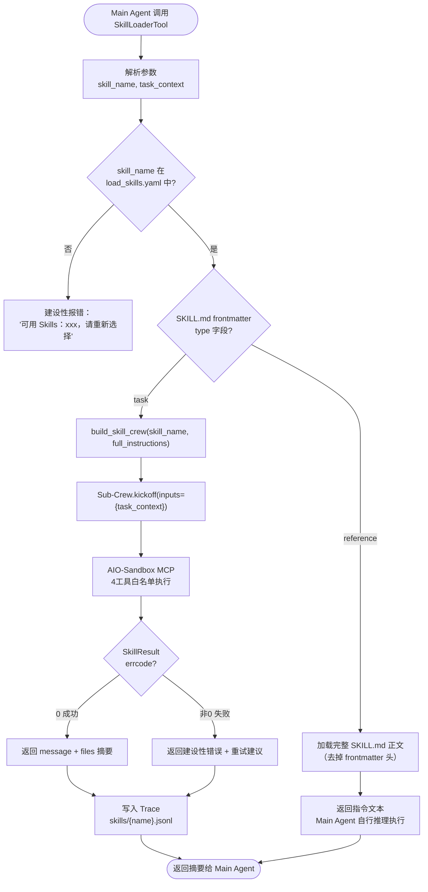
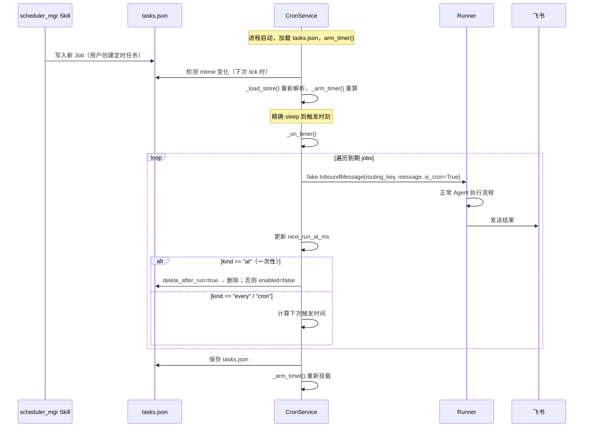
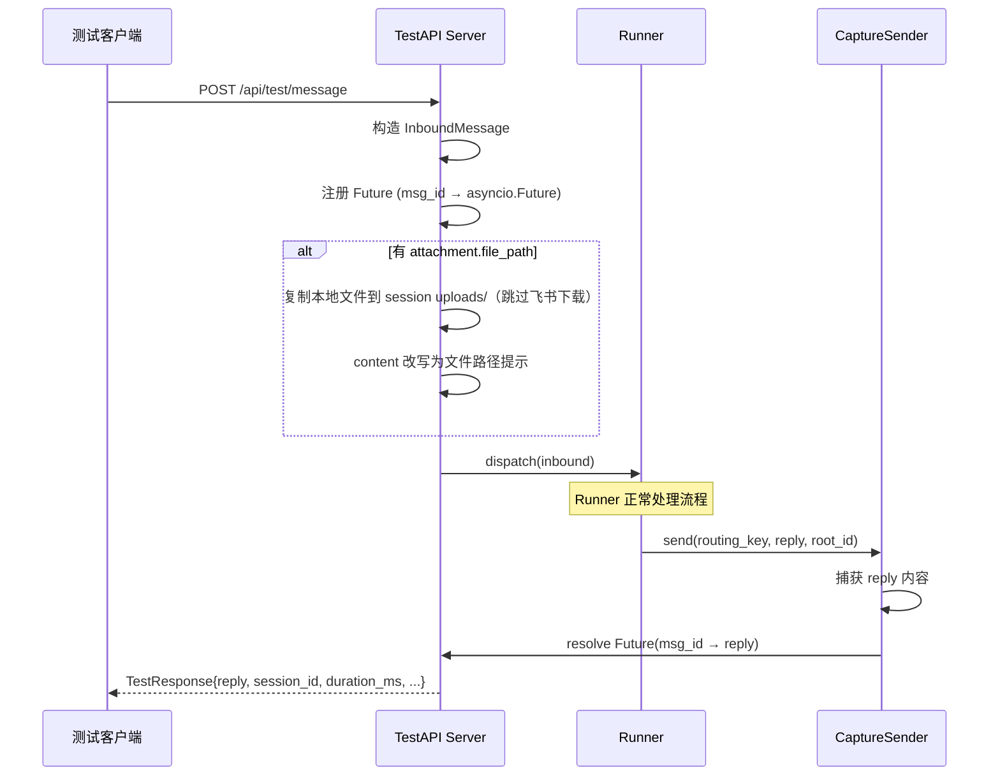

> 本文档是 [DESIGN.md](../DESIGN.md) §4 的详细内容
> 最后更新：2026-03-05

## 4. 模块设计

### 4.1 FeishuListener（飞书接入）

**职责**：维护 WebSocket 长连接，接收飞书事件，解析后交给下游。**不负责文件下载**（下载在 Runner 中 session 确定后执行）。

**接入方案**：WebSocket 长连接（lark-oapi `ws.Client`），无需公网 IP，适合本地/内网部署。

**消息类型处理**：

| msg_type | 处理逻辑 |
|----------|---------|
| `text` | 直接提取 `content.text`，构造 InboundMessage |
| `image` | 解析 `image_key`，存入 `attachment` 字段，content 置空 |
| `file` | 解析 `file_key` + `file_name`，存入 `attachment` 字段，content 置空 |
| `post` | 提取富文本纯文本部分，构造 InboundMessage |
| `audio` | 回复"暂不支持语音消息"，不进入 Agent |
| `sticker` | 忽略，不回复 |
| `merge_forward` | 回复"暂不支持转发合集"，不进入 Agent |

**关键逻辑**：
- 通过 `resolve_routing_key(event)` 将飞书事件转为 routing_key
- 解析消息内容和附件元信息（只记录 file_key，不下载）
- 构造 `InboundMessage`（含 `routing_key`、`content`、`msg_id`、`root_id`、`sender_id`、`ts`、`attachment`）

---

### 4.2 SessionRouter（会话路由）

**职责**：将飞书事件的三种会话类型统一映射为 `routing_key`，作为 Session 的唯一标识。

**路由规则**：

| 聊天类型 | 判断条件 | routing_key |
|---------|---------|-------------|
| 单聊 | `chat_type == "p2p"` | `p2p:{open_id}` |
| 普通群聊 | `chat_type == "group"` AND `thread_id` 为空 | `group:{chat_id}` |
| 话题群（某话题）| `chat_type == "group"` AND `thread_id` 非空 | `thread:{chat_id}:{thread_id}` |

**纯函数实现**：`resolve_routing_key(event)` — 无副作用，便于单元测试。

---

### 4.3 Runner（执行引擎）

**职责**：核心协调层，串联 Session 管理、Agent 执行、存储写入、消息回复。

**并发控制**：同一 `routing_key` 的消息**串行处理**，不同 routing_key 之间**并行**。

- 队列锁在 **routing_key** 上（同一用户/群/话题的消息串行）
- 每次 `_handle` 调用 `get_or_create(routing_key)` **动态解析**当前 `active_session_id`
- `/new` 命令在 `_handle_slash` 中更新 `active_session_id`，后续消息自动使用新 session
- 同一 routing_key 下可能存在多个历史 session，但同一时刻只有一个 active

```
routing_key（队列维度）        active_session_id（动态解析）
─────────────────────        ─────────────────────────────
p2p:ou_abc123           →    s-uuid-002（/new 后变为 s-uuid-003）
group:oc_chat456        →    s-uuid-004
thread:oc_chat789:ot_x  →    s-uuid-005
```

**队列模型**：
- 每个 routing_key 维护一个 `asyncio.Queue`，消息按到达顺序入队
- 首条消息入队时自动启动该 routing_key 的 worker coroutine
- worker 逐条消费，执行完一条再取下一条
- 队列空闲超时后 worker 自动退出，释放内存

**`_handle` 执行步骤**：
1. Slash Command 拦截（不进入 Agent）
2. 动态解析当前 active session
3. 附件下载（session 确定后才知道目标目录）
4. 加载对话历史（最近 max_turns 条）
5. 构建 Crew（注入 verbose step_callback）
6. 构建 Trace Writer
7. 执行主 Agent
8. 写 Trace + Session，发送回复

**Slash Command 处理**（在进入 Agent 前拦截）：

| 命令 | 处理逻辑 |
|------|---------|
| `/new` | 创建新 Session，更新 index.json active_session_id |
| `/verbose on/off` | 更新 session.verbose，立即生效 |

---

### 4.4 Main Agent + SkillLoaderTool

**Main Agent 设计原则**：极简，唯一工具是 SkillLoaderTool。避免直接绑定飞书 API 等工具，保持 Agent 的能力可扩展性。

**配置要点**：
- role: "XiaoPaw 工作助手"
- tools: `[SkillLoaderTool(...)]` — 唯一工具
- llm: `qwen3-max`，max_iter: 50

**SkillLoaderTool 工作原理**（渐进式披露）：



---

### 4.5 Sub-Crew 工厂

**职责**：任务型 Skill 触发时，动态构建隔离的 Sub-Crew，接入 AIO-Sandbox。

**沙盒工具白名单**（4 个）：
- `sandbox_execute_bash`
- `sandbox_execute_code`
- `sandbox_file_operations`
- `sandbox_str_replace_editor`

**设计要点**：
- 每次 Skill 调用都构建**新实例**，防止状态污染
- Sub-Crew 不注入 `step_callback`（verbose 只推主 Agent）
- session_id 通过 task.description 注入，Agent 知道自己的工作目录
- Agent 配置：role=`{skill_name} 执行专家`，model=`qwen3-max`，max_iter=20
- Task 期望输出：JSON 格式的 `SkillResult`（output_pydantic=SkillResult）

---

### 4.6 CronService（定时调度）

**职责**：读取 `cron/tasks.json`，精确调度定时任务，触发时构造 fake InboundMessage 进入 Runner 管道。

**核心设计**：
- **asyncio timer**（非 APScheduler/轮询），精确睡眠到下一个 job 触发时刻
- **mtime 热重载**：scheduler_mgr Skill 写入 tasks.json 后，CronService 下次 tick 自动感知并重新解析
- **内置清理 Job**：每日 3:00 触发 CleanupService，内存注册不写入 tasks.json



**三种调度模式**：

| 用户说 | schedule.kind | 参数示例 | 到期后 |
|-------|--------------|---------|-------|
| 明天10点提醒开会 | `at` | `at_ms: 1738800000000` | `delete_after_run: true` 自动删除 |
| 每20分钟提醒站起来 | `every` | `every_ms: 1200000` | 循环执行 |
| 每周一早9点生成周报 | `cron` | `expr: "0 9 * * 1"`, `tz: "Asia/Shanghai"` | croniter 计算下次，循环执行 |

---

### 4.7 FeishuSender（消息发送）

**职责**：根据 routing_key 类型选择正确的飞书发送 API，含幂等控制和重试。

**API 选择逻辑**：

```mermaid
flowchart TD
    SEND([FeishuSender.send]) --> RK{routing_key 类型}

    RK -->|p2p:{open_id}| P2P["POST /im/v1/messages\nreceive_id_type=open_id"]
    RK -->|group:{chat_id}| GRP["POST /im/v1/messages\nreceive_id_type=chat_id"]
    RK -->|thread:{chat_id}:{thread_id}| THR["POST /im/v1/messages/:root_id/reply\nreply_in_thread=true"]

    P2P & GRP & THR --> BODY["RequestBody\nmsg_type='text'\ncontent='{\"text\":\"...\"}'\nuuid={msg_id}  ← 幂等去重"]
    BODY --> RESP{API 响应}
    RESP -->|成功| DONE([完成])
    RESP -->|失败| RETRY["最多重试 3 次\n指数退避 1s/2s/4s"]
```

**关键点**：
- 话题群（thread）回复：使用 `ReplyMessage` API，`message_id=root_id`，`reply_in_thread=True`
- `uuid` 字段传入 `feishu_msg_id`，防止网络重试重复发送（飞书幂等去重）
- Bot 自身回复**不走 Skill**，直接在 Runner 层调用 FeishuSender

---

### 4.8 CleanupService（存储清理）

**职责**：按策略清理过期文件，防止磁盘无限增长。双触发：启动时 Sweep + 每日 3:00 定时任务。

**清理策略**：

| 目录 | 保留天数 |
|------|---------|
| `data/workspace/sessions/*/tmp/` | 1 天（Session 结束时主动清理，兜底 1 天）|
| `data/workspace/sessions/*/uploads/` | 7 天 |
| `data/workspace/sessions/*/outputs/` | 30 天 |
| `data/traces/` | 30 天 |
| `data/sessions/*.jsonl` | 365 天 |

详见主文件 §11.2 存储清理策略。

---

### 4.9 TestAPI（测试接口）

**职责**：提供 HTTP 接口模拟飞书消息事件，绕过 WebSocket 直接注入 Runner，同步返回 Bot 回复。仅 `debug.enable_test_api: true` 时启用。

**设计要点**：
- 与 FeishuListener 入口等价：构造 InboundMessage → `Runner.dispatch()`
- 通过可替换的 `FeishuSender` 接口捕获回复内容，同步返回给调用方
- 支持模拟附件消息（提供本地文件路径，跳过飞书下载）
- 集成测试可编排多轮对话、验证 session 隔离、测试 slash command

**API 端点**：

```
POST /api/test/message         → 发送消息，同步等待 Bot 回复
POST /api/test/message/async   → 发送消息，立即返回 msg_id，通过回调或轮询获取回复
GET  /api/test/session/:routing_key → 查看当前 session 状态和对话历史
DELETE /api/test/sessions       → 清空所有测试 session 数据
```

**请求/响应结构**（核心字段）：

```
TestRequest:
  routing_key: str          # 必填："p2p:ou_test001" 等
  content: str              # 用户消息文本
  msg_id: str | None        # 可选，自动生成 "test_{uuid}"
  sender_id: str            # 模拟用户 open_id
  attachment.file_path: str # 本地文件路径（非飞书 file_key）

TestResponse:
  msg_id: str               # 请求消息 ID
  reply: str                # Bot 回复内容
  session_id: str           # 使用的 session ID
  duration_ms: int          # 处理耗时
  skills_called: list[str]  # 调用的 Skill 列表
```

**实现架构**：



**CaptureSender**：实现 `SenderProtocol`（与 `FeishuSender` 共同接口），通过 `asyncio.Future` 捕获回复内容。Runner 构造时注入 `sender: SenderProtocol`，测试时替换为 `CaptureSender`。

**测试模式下附件处理**：
1. 解析 routing_key → 获取当前 active session_id
2. 将文件复制到 `data/workspace/sessions/{sid}/uploads/`
3. 将 InboundMessage.content 改写为沙盒路径提示
4. 不设置 `inbound.attachment`（跳过 Runner 的飞书下载步骤）
